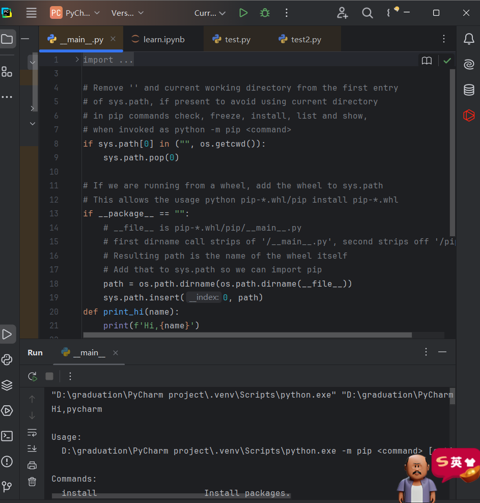
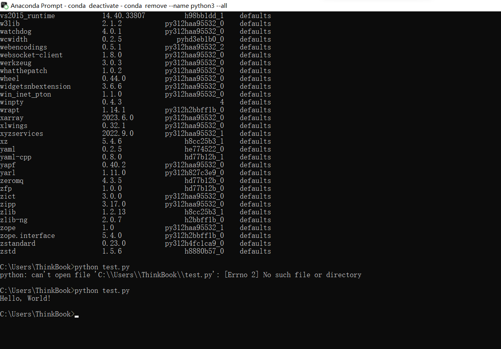
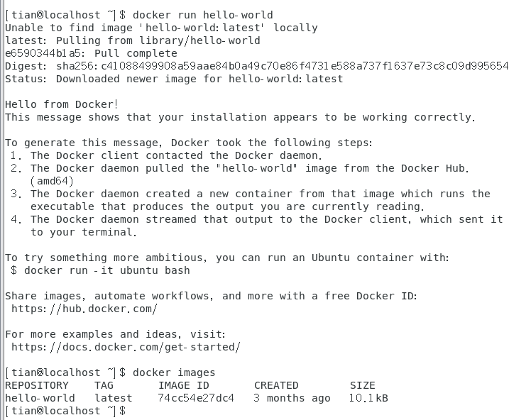

{
 "cells": [
  {
   "cell_type": "markdown",
   "id": "83cb8016-f6ad-4df8-8595-e5dd8affc648",
   "metadata": {},
   "source": [
    "#pycharm创建及使用"
   ]
  },
  {
   "attachments": {},
   "cell_type": "markdown",
   "id": "81750745-3221-4691-828d-981b4247d5db",
   "metadata": {},
   "source": [
    ""
   ]
  },
  {
   "cell_type": "markdown",
   "id": "fc370b05-83cf-4feb-a458-600f4abbdc01",
   "metadata": {},
   "source": [
    "#conda完成python环境搭建并输出"
   ]
  },
  {
   "attachments": {},
   "cell_type": "markdown",
   "id": "43f6446a-7492-4d62-a664-da9743ab9e2d",
   "metadata": {},
   "source": [
    ""
   ]
  },
  {
   "cell_type": "markdown",
   "id": "58713f83-2dcf-4d69-ad50-815cf72d9147",
   "metadata": {},
   "source": [
    "#docker使用输出hello，world！"
   ]
  },
  {
   "attachments": {},
   "cell_type": "markdown",
   "id": "fa7a0557-49bd-40ac-b559-db2f3d13ba9b",
   "metadata": {},
   "source": [
    ""
   ]
  }
 ],
 "metadata": {
  "kernelspec": {
   "display_name": "Python [conda env:base] *",
   "language": "python",
   "name": "conda-base-py"
  },
  "language_info": {
   "codemirror_mode": {
    "name": "ipython",
    "version": 3
   },
   "file_extension": ".py",
   "mimetype": "text/x-python",
   "name": "python",
   "nbconvert_exporter": "python",
   "pygments_lexer": "ipython3",
   "version": "3.12.7"
  }
 },
 "nbformat": 4,
 "nbformat_minor": 5
}
