{
 "cells": [
  {
   "cell_type": "markdown",
   "id": "a0d0fd8b-5218-4828-9864-470d4df0a334",
   "metadata": {},
   "source": [
    "linux磁盘管理："
   ]
  },
  {
   "cell_type": "markdown",
   "id": "c54b7560-40bb-4a06-8b28-f99a7388a434",
   "metadata": {},
   "source": [
    "列出磁盘使用量"
   ]
  },
  {
   "attachments": {},
   "cell_type": "markdown",
   "id": "66314f93-333a-4a84-bed1-09185d781c37",
   "metadata": {},
   "source": [
    "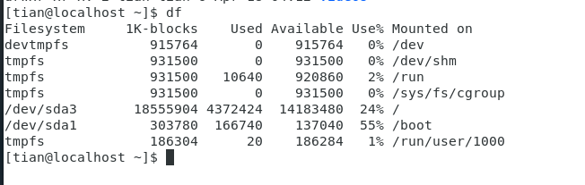"
   ]
  },
  {
   "cell_type": "markdown",
   "id": "ba3d5ce4-d95f-4cea-ac0b-3d132318168b",
   "metadata": {},
   "source": [
    "结果以易读格式显示"
   ]
  },
  {
   "attachments": {},
   "cell_type": "markdown",
   "id": "f8e57bce-2148-4f40-b3a2-e6bcca6f2a79",
   "metadata": {},
   "source": [
    "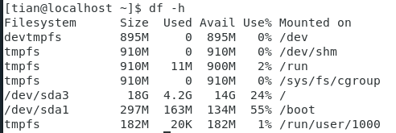"
   ]
  },
  {
   "cell_type": "markdown",
   "id": "7bd559b7-829b-44cc-aa30-573a875b68ce",
   "metadata": {},
   "source": [
    "列出系统内所有特殊文件格式及名称"
   ]
  },
  {
   "attachments": {},
   "cell_type": "markdown",
   "id": "6291c2e8-3b15-407e-a2c2-2a816badaee4",
   "metadata": {},
   "source": [
    "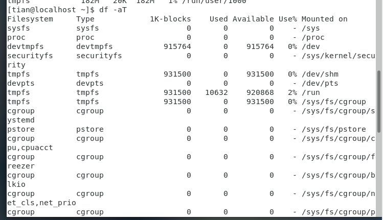"
   ]
  },
  {
   "attachments": {},
   "cell_type": "markdown",
   "id": "05f68d36-5fbf-4f74-8066-15f4dfbe1df3",
   "metadata": {},
   "source": [
    "将/etc底下的可用磁盘容量以易读的容量格式显示"
   ]
  },
  {
   "attachments": {},
   "cell_type": "markdown",
   "id": "93a869dc-5cb1-4e8d-a908-06b0f2b4ffe1",
   "metadata": {},
   "source": [
    "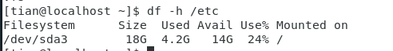"
   ]
  },
  {
   "cell_type": "markdown",
   "id": "49435ada-9416-4795-a777-b7d8d0b7ba86",
   "metadata": {},
   "source": [
    "只列出当前目录下的所有文件夹容量："
   ]
  },
  {
   "attachments": {},
   "cell_type": "markdown",
   "id": "3abaa499-d798-4e8b-8d5f-4844b429b8d4",
   "metadata": {},
   "source": [
    "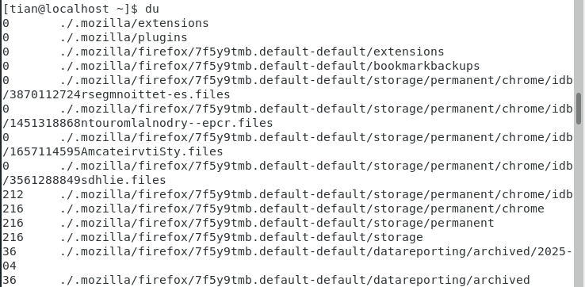"
   ]
  },
  {
   "cell_type": "markdown",
   "id": "46ccbb69-2d82-4402-a0dc-6bdc0b012a4e",
   "metadata": {},
   "source": [
    " 将文件的容量也列出："
   ]
  },
  {
   "attachments": {},
   "cell_type": "markdown",
   "id": "84e90e98-738f-436d-931d-430fc5eb566a",
   "metadata": {},
   "source": [
    "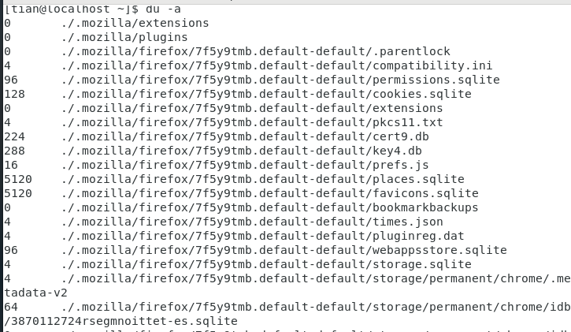"
   ]
  },
  {
   "cell_type": "markdown",
   "id": "e1e031bb-9392-4664-9589-ec8431f53c6d",
   "metadata": {},
   "source": [
    "检查根目录底下每个目录所占用容量"
   ]
  },
  {
   "attachments": {},
   "cell_type": "markdown",
   "id": "423cb4da-a31a-4eb0-a537-2e5b3dac36eb",
   "metadata": {},
   "source": [
    "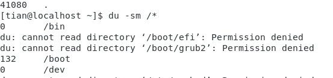"
   ]
  },
  {
   "cell_type": "markdown",
   "id": "f4661708-460e-48ff-9f4a-b84fb200d7c8",
   "metadata": {},
   "source": [
    "列出linux所有分区信息"
   ]
  },
  {
   "attachments": {},
   "cell_type": "markdown",
   "id": "4a4a0a56-e693-4b0f-9eea-9599785a1b38",
   "metadata": {},
   "source": [
    "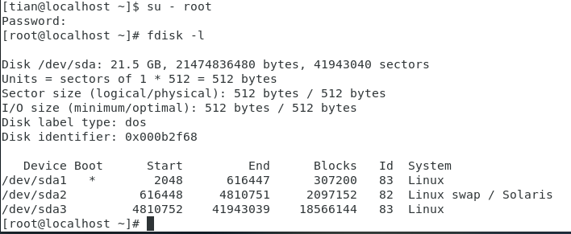"
   ]
  },
  {
   "cell_type": "markdown",
   "id": "2d0ca497-6e8d-400f-9d47-e38bcb41c265",
   "metadata": {},
   "source": [
    "找出系统中的根目录所在磁盘，查阅相关信息"
   ]
  },
  {
   "attachments": {},
   "cell_type": "markdown",
   "id": "88eab25d-9227-4de8-809b-a4bbe393e26a",
   "metadata": {},
   "source": [
    "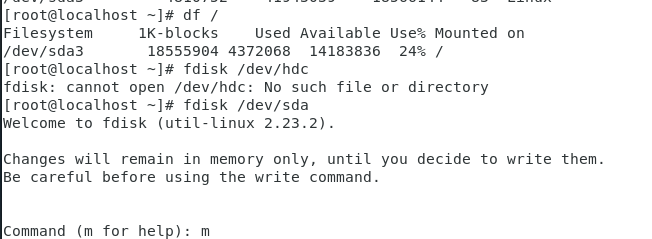"
   ]
  },
  {
   "cell_type": "markdown",
   "id": "557977b0-d3d8-4d6b-bd4e-f499de3437eb",
   "metadata": {},
   "source": [
    "输入m查看命令介绍"
   ]
  },
  {
   "attachments": {},
   "cell_type": "markdown",
   "id": "e0389c2a-22b5-42ce-b2ed-e7c01f3b081a",
   "metadata": {},
   "source": [
    "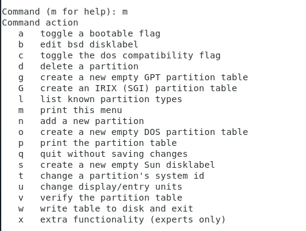"
   ]
  },
  {
   "cell_type": "markdown",
   "id": "4f121818-58b4-461f-ad76-b83ecefa7650",
   "metadata": {},
   "source": [
    "输入p，输出目前磁盘状态，q不储存离开"
   ]
  },
  {
   "attachments": {},
   "cell_type": "markdown",
   "id": "8f334b80-94d6-476a-91f3-f0a8a695dbb1",
   "metadata": {},
   "source": [
    "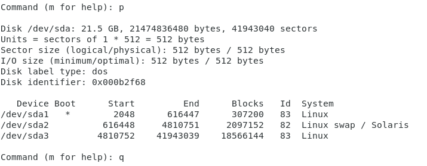"
   ]
  },
  {
   "cell_type": "markdown",
   "id": "9d637b5a-9beb-4184-bfa5-860375138eae",
   "metadata": {},
   "source": [
    "磁盘格式化："
   ]
  },
  {
   "cell_type": "markdown",
   "id": "41b7a5fa-e9f2-4e6d-9eaa-ee66f74ec397",
   "metadata": {},
   "source": [
    "查看mkfs支持的文件格式"
   ]
  },
  {
   "attachments": {},
   "cell_type": "markdown",
   "id": "a2d96832-a274-4639-bc8e-de08644ee9ff",
   "metadata": {},
   "source": [
    "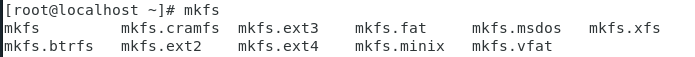"
   ]
  },
  {
   "cell_type": "markdown",
   "id": "7249383e-0fed-458b-a29f-0d8c248475b0",
   "metadata": {},
   "source": [
    "磁盘检验："
   ]
  },
  {
   "cell_type": "markdown",
   "id": "9bcddaee-112d-4959-82b8-e7ae5c2fd525",
   "metadata": {},
   "source": [
    "查看系统有多少文件系统支持的fsck命令"
   ]
  },
  {
   "attachments": {},
   "cell_type": "markdown",
   "id": "dd8b1e7b-4dee-45db-a007-615465a3c2db",
   "metadata": {},
   "source": [
    "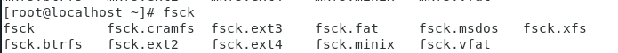"
   ]
  },
  {
   "cell_type": "markdown",
   "id": "0290a284-752e-4e5f-b2eb-1fd8105ceb80",
   "metadata": {},
   "source": [
    "Vi/vim使用："
   ]
  },
  {
   "cell_type": "markdown",
   "id": "6ae95d93-995b-4230-92de-2d2750d3371d",
   "metadata": {},
   "source": [
    "建立一个名为runoob.txt的文件"
   ]
  },
  {
   "attachments": {},
   "cell_type": "markdown",
   "id": "aaeea3c2-17d2-4550-af0f-c0002ad09c35",
   "metadata": {},
   "source": [
    "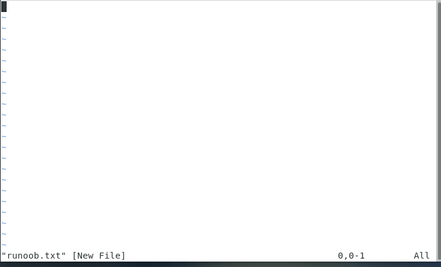"
   ]
  },
  {
   "cell_type": "markdown",
   "id": "de558c46-5c7c-4d55-be50-661ec8f9165f",
   "metadata": {},
   "source": [
    "Esc退回一般模式 ：wq保存离开"
   ]
  },
  {
   "attachments": {},
   "cell_type": "markdown",
   "id": "96899860-5580-4244-baf3-634fa29391d0",
   "metadata": {},
   "source": [
    "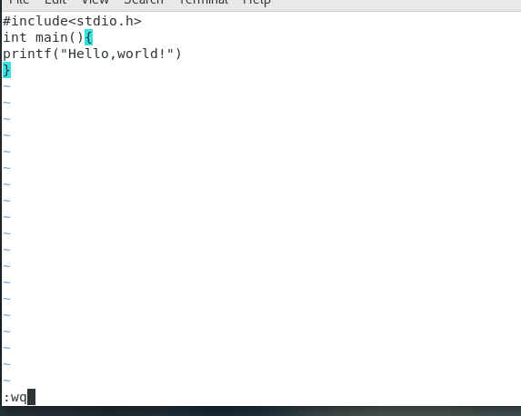"
   ]
  },
  {
   "cell_type": "markdown",
   "id": "1a09efb3-c4b6-486f-af2c-36d16dfae430",
   "metadata": {},
   "source": [
    "LINUX yum（shell前端软件包管理器，查找、安装、删除软件包）命令："
   ]
  },
  {
   "cell_type": "markdown",
   "id": "bb740534-d145-47b5-b8e2-f1cfeb4433a5",
   "metadata": {},
   "source": [
    "安装pam-devel"
   ]
  },
  {
   "attachments": {},
   "cell_type": "markdown",
   "id": "1a5311a1-0450-45fa-86a9-4c9dc387d075",
   "metadata": {},
   "source": [
    "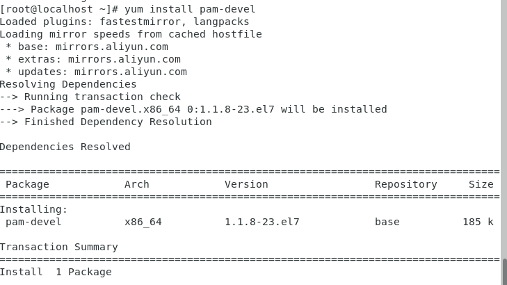"
   ]
  },
  {
   "cell_type": "markdown",
   "id": "efacb9bd-c391-4bd1-8daf-20764de60bde",
   "metadata": {},
   "source": [
    "移除pam-devel"
   ]
  },
  {
   "attachments": {},
   "cell_type": "markdown",
   "id": "d167c26e-7d34-47cf-9ec8-56a4bc6f78d0",
   "metadata": {},
   "source": [
    "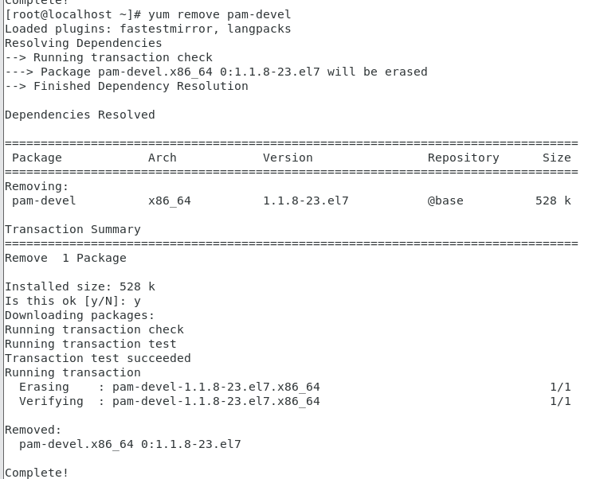"
   ]
  },
  {
   "cell_type": "markdown",
   "id": "54d5df01-354a-48af-bdf9-ffa4f837fe65",
   "metadata": {},
   "source": [
    "找出以pam为开头的软件名称"
   ]
  },
  {
   "attachments": {},
   "cell_type": "markdown",
   "id": "58c481b6-0120-4803-8c1c-39721919ba0e",
   "metadata": {},
   "source": [
    "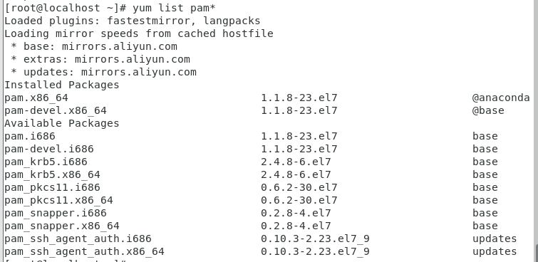"
   ]
  },
  {
   "cell_type": "markdown",
   "id": "9da3bd38-3f44-492b-b738-f10ad7104660",
   "metadata": {},
   "source": []
  }
 ],
 "metadata": {
  "kernelspec": {
   "display_name": "Python [conda env:base] *",
   "language": "python",
   "name": "conda-base-py"
  },
  "language_info": {
   "codemirror_mode": {
    "name": "ipython",
    "version": 3
   },
   "file_extension": ".py",
   "mimetype": "text/x-python",
   "name": "python",
   "nbconvert_exporter": "python",
   "pygments_lexer": "ipython3",
   "version": "3.12.7"
  }
 },
 "nbformat": 4,
 "nbformat_minor": 5
}
