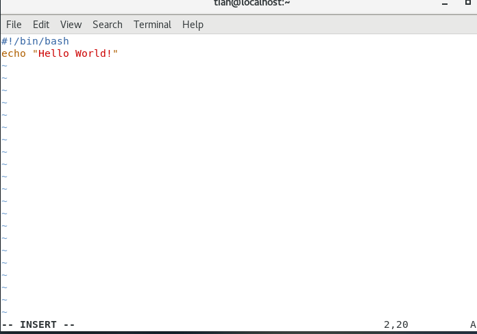
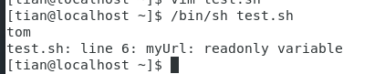
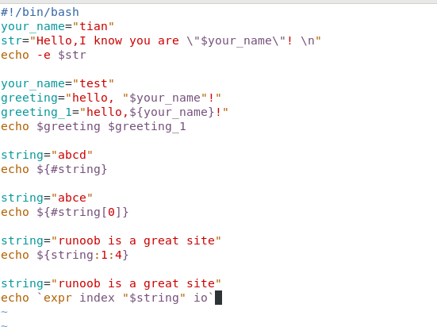
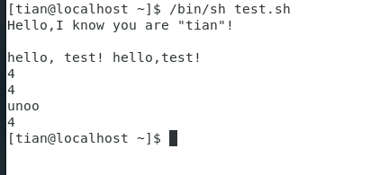

{
 "cells": [
  {
   "cell_type": "markdown",
   "id": "9a4bc4f8-4f02-4397-bb4b-91f91e4a6c5e",
   "metadata": {},
   "source": [
    "Shell"
   ]
  },
  {
   "cell_type": "markdown",
   "id": "52d8f06f-cdcd-475f-9e71-966898d38e22",
   "metadata": {},
   "source": [
    "新建shell脚本 test.sh"
   ]
  },
  {
   "attachments": {},
   "cell_type": "markdown",
   "id": "38e5629d-35a6-49d3-b489-33759cb65739",
   "metadata": {},
   "source": [
    ""
   ]
  },
  {
   "cell_type": "markdown",
   "id": "35cacf67-872e-4463-9c61-9148b9c0d922",
   "metadata": {},
   "source": [
    "运行shell脚本方法一："
   ]
  },
  {
   "attachments": {},
   "cell_type": "markdown",
   "id": "3437c383-0c96-493f-bbdf-9a90dbe4e079",
   "metadata": {},
   "source": [
    ""
   ]
  },
  {
   "cell_type": "markdown",
   "id": "2fbc2c21-2a25-4953-8acc-1f46da29d68d",
   "metadata": {},
   "source": [
    "运行shell脚本方法2："
   ]
  },
  {
   "attachments": {},
   "cell_type": "markdown",
   "id": "27e16e11-14d1-4cf2-b4ab-085f33a455df",
   "metadata": {},
   "source": [
    ""
   ]
  },
  {
   "cell_type": "markdown",
   "id": "a77c5e59-e398-4b4d-869e-b34e7315fc72",
   "metadata": {},
   "source": [
    "shell定义变量并输出包括只读变量"
   ]
  },
  {
   "attachments": {},
   "cell_type": "markdown",
   "id": "47dd00a1-d1bd-49de-beae-44674600bb79",
   "metadata": {},
   "source": [
    ""
   ]
  },
  {
   "attachments": {},
   "cell_type": "markdown",
   "id": "86482983-fe8b-4b04-b7e4-45f071c2b22a",
   "metadata": {},
   "source": [
    ""
   ]
  },
  {
   "cell_type": "markdown",
   "id": "7e548527-25c9-4727-a036-bad37b59731f",
   "metadata": {},
   "source": [
    "字符串相关操作：定义，字符串拼接（单双引号都可），获取字符串长度，提取子字符串，查找（i或o的位置）"
   ]
  },
  {
   "attachments": {},
   "cell_type": "markdown",
   "id": "a7529efb-8bd3-49b0-b4af-35b270c2fc87",
   "metadata": {},
   "source": [
    ""
   ]
  },
  {
   "attachments": {},
   "cell_type": "markdown",
   "id": "150cd5ca-2d69-4ad7-8ced-ed78d4ea6873",
   "metadata": {},
   "source": [
    ""
   ]
  },
  {
   "cell_type": "markdown",
   "id": "5cccc7c6-ea7f-420d-b9d4-20d92c43054e",
   "metadata": {},
   "source": [
    "shell数组创建，读取数组，关联数组"
   ]
  },
  {
   "attachments": {},
   "cell_type": "markdown",
   "id": "e0599ee0-c90e-4b2a-8eb0-f38e87eb813f",
   "metadata": {},
   "source": [
    ""
   ]
  },
  {
   "attachments": {},
   "cell_type": "markdown",
   "id": "41010085-1ff2-4e49-97f3-e584eb960437",
   "metadata": {},
   "source": [
    ""
   ]
  },
  {
   "cell_type": "markdown",
   "id": "ba605ea4-94b6-48c5-97ec-b3bddfdd4b05",
   "metadata": {},
   "source": [
    "获取数组中所有元素和数组长度"
   ]
  },
  {
   "attachments": {},
   "cell_type": "markdown",
   "id": "0a69e215-e074-4dd0-b152-d6e5ebbb55c2",
   "metadata": {},
   "source": [
    ""
   ]
  },
  {
   "attachments": {},
   "cell_type": "markdown",
   "id": "cb618a75-98f6-4911-a587-9d86cda304dd",
   "metadata": {},
   "source": [
    ""
   ]
  },
  {
   "cell_type": "markdown",
   "id": "9032dd39-0971-40b2-9239-9c9b43729c57",
   "metadata": {},
   "source": [
    "shell基本运算符：算术运算符"
   ]
  },
  {
   "attachments": {},
   "cell_type": "markdown",
   "id": "a26943ba-a3dd-4b72-9783-1df9cac622d8",
   "metadata": {},
   "source": [
    ""
   ]
  },
  {
   "attachments": {},
   "cell_type": "markdown",
   "id": "5315f24b-adde-445f-9dac-eeaa49b235f5",
   "metadata": {},
   "source": [
    ""
   ]
  },
  {
   "cell_type": "markdown",
   "id": "e367d035-b432-48db-a0fa-94872c73330b",
   "metadata": {},
   "source": [
    "关系运算符"
   ]
  },
  {
   "attachments": {},
   "cell_type": "markdown",
   "id": "72f07ca1-afc9-4fb3-a7d2-e1f437baddf3",
   "metadata": {},
   "source": [
    ""
   ]
  },
  {
   "attachments": {},
   "cell_type": "markdown",
   "id": "cef35bdb-7294-45f0-8d05-844dd8a1d5dc",
   "metadata": {},
   "source": [
    ""
   ]
  },
  {
   "cell_type": "markdown",
   "id": "61fdc586-2b9e-4913-9f88-d168fff0e17f",
   "metadata": {},
   "source": [
    "布尔运算符"
   ]
  },
  {
   "attachments": {},
   "cell_type": "markdown",
   "id": "e9c21633-a382-4684-9ee9-2c2dd2816a07",
   "metadata": {},
   "source": [
    ""
   ]
  },
  {
   "attachments": {},
   "cell_type": "markdown",
   "id": "5e7ff80a-02ad-4328-8a46-71e4803e64a7",
   "metadata": {},
   "source": [
    ""
   ]
  },
  {
   "cell_type": "markdown",
   "id": "a23e3fa3-dac7-4fe8-b432-5ddf5b904e94",
   "metadata": {},
   "source": [
    "逻辑运算符"
   ]
  },
  {
   "attachments": {},
   "cell_type": "markdown",
   "id": "c6386086-c4ed-4bdf-bea5-50fe4f000bc4",
   "metadata": {},
   "source": [
    ""
   ]
  },
  {
   "attachments": {},
   "cell_type": "markdown",
   "id": "e259e639-5fc5-41cc-af19-b043c277b9fa",
   "metadata": {},
   "source": [
    ""
   ]
  },
  {
   "cell_type": "markdown",
   "id": "365b6a74-f7ce-4591-b4fa-aa287d7f2179",
   "metadata": {},
   "source": [
    "字符串运算符"
   ]
  },
  {
   "attachments": {},
   "cell_type": "markdown",
   "id": "9e885d72-243e-4f78-8ef0-a62a3e02edf6",
   "metadata": {},
   "source": [
    ""
   ]
  },
  {
   "attachments": {},
   "cell_type": "markdown",
   "id": "fd2b9eac-9077-40d4-b677-8128f2eda516",
   "metadata": {},
   "source": [
    ""
   ]
  },
  {
   "cell_type": "markdown",
   "id": "8ed9af84-4740-4bba-be97-9f4f094e55f9",
   "metadata": {},
   "source": [
    "文件测试运算符"
   ]
  },
  {
   "attachments": {},
   "cell_type": "markdown",
   "id": "5e3a3c78-b03f-4154-81c8-eeddc3e89586",
   "metadata": {},
   "source": [
    ""
   ]
  },
  {
   "attachments": {},
   "cell_type": "markdown",
   "id": "3d8a445b-96f1-4545-a49f-f8d803d49a95",
   "metadata": {},
   "source": [
    ""
   ]
  },
  {
   "cell_type": "markdown",
   "id": "9ae85cee-2311-4b65-af79-f0c3fd193727",
   "metadata": {},
   "source": [
    "自增和自减操作符"
   ]
  },
  {
   "attachments": {},
   "cell_type": "markdown",
   "id": "366be257-a7ac-4906-8d07-0a5f3f4f938b",
   "metadata": {},
   "source": [
    ""
   ]
  },
  {
   "attachments": {},
   "cell_type": "markdown",
   "id": "f8b0a3ad-d762-4780-9451-addc96760ebe",
   "metadata": {},
   "source": [
    ""
   ]
  },
  {
   "cell_type": "markdown",
   "id": "5111cdf5-589e-4042-bc00-6679da876e05",
   "metadata": {},
   "source": [
    "shell echo命令"
   ]
  },
  {
   "attachments": {},
   "cell_type": "markdown",
   "id": "c52efcf6-f0ec-4479-b5b1-6c230080b354",
   "metadata": {},
   "source": [
    ""
   ]
  },
  {
   "cell_type": "markdown",
   "id": "dcd717e3-287a-4375-86d4-c915be072f44",
   "metadata": {},
   "source": [
    "shell printf命令"
   ]
  },
  {
   "attachments": {},
   "cell_type": "markdown",
   "id": "0f4d5ac5-d5b0-4b99-baad-585aa5ce1b8a",
   "metadata": {},
   "source": [
    ""
   ]
  },
  {
   "attachments": {},
   "cell_type": "markdown",
   "id": "7a8109cc-10f7-4c30-8e3a-3f2ed9ca758e",
   "metadata": {},
   "source": [
    ""
   ]
  },
  {
   "cell_type": "markdown",
   "id": "1727a7da-eac4-42f1-8b26-374f6991ca8f",
   "metadata": {},
   "source": [
    "printf的转义序列"
   ]
  },
  {
   "attachments": {},
   "cell_type": "markdown",
   "id": "4480193a-139a-4c96-9975-0fdc491ed857",
   "metadata": {},
   "source": [
    ""
   ]
  },
  {
   "cell_type": "markdown",
   "id": "674d1675-63bd-46b7-8423-a34bb38d5864",
   "metadata": {},
   "source": [
    "shell test命令：数值测试"
   ]
  },
  {
   "attachments": {},
   "cell_type": "markdown",
   "id": "317f5b00-00dc-4585-8d47-724f9610382f",
   "metadata": {},
   "source": [
    ""
   ]
  },
  {
   "attachments": {},
   "cell_type": "markdown",
   "id": "3fbcb815-5f63-464d-aa0a-a0f28270d0d4",
   "metadata": {},
   "source": [
    ""
   ]
  },
  {
   "cell_type": "markdown",
   "id": "e81c99ca-7a83-4989-af9e-657e6d874908",
   "metadata": {},
   "source": [
    "字符串，文件测试"
   ]
  },
  {
   "attachments": {},
   "cell_type": "markdown",
   "id": "42a21d62-c53f-4d5f-afc0-9304a0ded9ee",
   "metadata": {},
   "source": [
    ""
   ]
  },
  {
   "attachments": {},
   "cell_type": "markdown",
   "id": "fdefb6b0-2c44-4df4-906d-6d7cff4bd91b",
   "metadata": {},
   "source": [
    ""
   ]
  },
  {
   "cell_type": "markdown",
   "id": "b0614c68-dfb4-4c17-9ad3-e3e62dd0a692",
   "metadata": {},
   "source": [
    "shell流程控制：if else"
   ]
  },
  {
   "attachments": {},
   "cell_type": "markdown",
   "id": "8e8c2b5a-f28d-4299-a76a-2f8db516d697",
   "metadata": {},
   "source": [
    ""
   ]
  },
  {
   "attachments": {},
   "cell_type": "markdown",
   "id": "77e49c7a-b342-4968-9a8e-ee125f25c3e4",
   "metadata": {},
   "source": [
    ""
   ]
  },
  {
   "cell_type": "markdown",
   "id": "1b3d296b-3e0f-4327-925f-43e8bcdbfcec",
   "metadata": {},
   "source": [
    "for循环"
   ]
  },
  {
   "attachments": {},
   "cell_type": "markdown",
   "id": "9bd4428e-e9a1-4116-b8db-761825969776",
   "metadata": {},
   "source": [
    ""
   ]
  },
  {
   "attachments": {},
   "cell_type": "markdown",
   "id": "816a02d4-f37b-48c4-91a9-629a69a5a66b",
   "metadata": {},
   "source": [
    ""
   ]
  },
  {
   "cell_type": "markdown",
   "id": "d2b058a7-ce1a-4f6d-9d42-0d37bf33bf73",
   "metadata": {},
   "source": [
    "while语句"
   ]
  },
  {
   "attachments": {},
   "cell_type": "markdown",
   "id": "05d8519e-a47c-4e2f-83d3-2b3ace6b7d72",
   "metadata": {},
   "source": [
    ""
   ]
  },
  {
   "attachments": {},
   "cell_type": "markdown",
   "id": "f66417a2-aaa6-43d3-841f-d88f3cac53f5",
   "metadata": {},
   "source": [
    ""
   ]
  },
  {
   "cell_type": "markdown",
   "id": "27b70e8f-63e7-4b4e-b2b0-88502756ec42",
   "metadata": {},
   "source": [
    "until循环"
   ]
  },
  {
   "attachments": {},
   "cell_type": "markdown",
   "id": "1ba6f02b-9077-40a3-b49d-e091b31e8ead",
   "metadata": {},
   "source": [
    ""
   ]
  },
  {
   "attachments": {},
   "cell_type": "markdown",
   "id": "12ce8c3e-35ff-4e27-b0b6-d6026132aee4",
   "metadata": {},
   "source": [
    ""
   ]
  },
  {
   "cell_type": "markdown",
   "id": "4b209735-e265-4c4d-bef9-db4f00b9c28c",
   "metadata": {},
   "source": [
    "case ... esac"
   ]
  },
  {
   "attachments": {},
   "cell_type": "markdown",
   "id": "b2c4baf3-1d99-40bf-9768-3e847780b5ca",
   "metadata": {},
   "source": [
    ""
   ]
  },
  {
   "attachments": {},
   "cell_type": "markdown",
   "id": "3d508c6f-293d-4b74-b1b8-9edad24766ce",
   "metadata": {},
   "source": [
    ""
   ]
  },
  {
   "cell_type": "markdown",
   "id": "e56da239-9413-46d9-b5d2-e24090ddd52b",
   "metadata": {},
   "source": [
    "跳出循环：\n",
    "break和continue"
   ]
  },
  {
   "attachments": {},
   "cell_type": "markdown",
   "id": "bb05b965-2ef6-4ecc-8ee8-ccd0d13a55a8",
   "metadata": {},
   "source": [
    ""
   ]
  },
  {
   "attachments": {},
   "cell_type": "markdown",
   "id": "9c16a56d-c687-4737-852a-9a32adbcad04",
   "metadata": {},
   "source": [
    ""
   ]
  },
  {
   "cell_type": "markdown",
   "id": "180b2165-2e58-4130-af81-342173f3cfe6",
   "metadata": {},
   "source": [
    "shell函数"
   ]
  },
  {
   "attachments": {},
   "cell_type": "markdown",
   "id": "44bb7e89-a32b-474a-98ad-f9b29e040dc4",
   "metadata": {},
   "source": [
    ""
   ]
  },
  {
   "attachments": {},
   "cell_type": "markdown",
   "id": "46d4db4e-1c5d-457d-8114-5ebd5a2c34be",
   "metadata": {},
   "source": [
    ""
   ]
  },
  {
   "cell_type": "markdown",
   "id": "f0ac13ab-900a-4b9d-a6de-9ab2a05f62e2",
   "metadata": {},
   "source": [
    "shell函数参数："
   ]
  },
  {
   "attachments": {},
   "cell_type": "markdown",
   "id": "1785628c-315c-4a25-8462-5f545406197f",
   "metadata": {},
   "source": [
    ""
   ]
  },
  {
   "attachments": {},
   "cell_type": "markdown",
   "id": "d8a86388-26c6-4275-8637-6f42d3b7ce1d",
   "metadata": {},
   "source": [
    ""
   ]
  },
  {
   "cell_type": "markdown",
   "id": "e8d4d6af-0c71-4b76-baa7-414436b1446b",
   "metadata": {},
   "source": [
    "shell输出重定向：不覆盖文件内容用>>追加到文件末尾"
   ]
  },
  {
   "attachments": {},
   "cell_type": "markdown",
   "id": "0f35ed90-6a57-422e-a2cc-e44cb8e14ac0",
   "metadata": {},
   "source": [
    ""
   ]
  },
  {
   "cell_type": "markdown",
   "id": "7616e661-27cf-489e-a77a-623ceac2574b",
   "metadata": {},
   "source": [
    "输入重定向：是否输出文件名，2只知道从标准输入读取内容"
   ]
  },
  {
   "attachments": {},
   "cell_type": "markdown",
   "id": "af7ff54b-cf82-4eb3-a36e-7741418b81c9",
   "metadata": {},
   "source": [
    ""
   ]
  },
  {
   "cell_type": "markdown",
   "id": "55d3e971-6b61-40c0-b665-141bd02db167",
   "metadata": {},
   "source": [
    "Here Document：重定向到一个交互式Shell脚本或程序"
   ]
  },
  {
   "attachments": {},
   "cell_type": "markdown",
   "id": "9a8d4906-bbe9-4242-9a52-8e4d24327a58",
   "metadata": {},
   "source": [
    ""
   ]
  },
  {
   "attachments": {},
   "cell_type": "markdown",
   "id": "3d8d1faa-b489-4075-b385-7a6230e9416d",
   "metadata": {},
   "source": [
    ""
   ]
  }
 ],
 "metadata": {
  "kernelspec": {
   "display_name": "Python [conda env:base] *",
   "language": "python",
   "name": "conda-base-py"
  },
  "language_info": {
   "codemirror_mode": {
    "name": "ipython",
    "version": 3
   },
   "file_extension": ".py",
   "mimetype": "text/x-python",
   "name": "python",
   "nbconvert_exporter": "python",
   "pygments_lexer": "ipython3",
   "version": "3.12.7"
  }
 },
 "nbformat": 4,
 "nbformat_minor": 5
}
